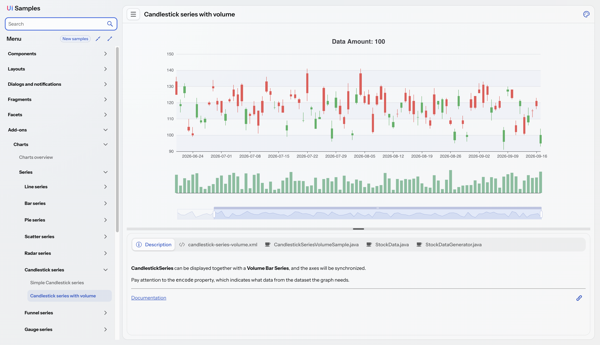
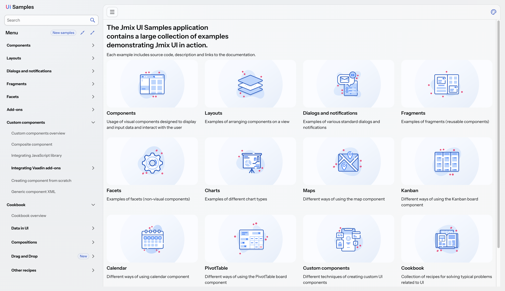

# Jmix UI Samples

**A live, browsable catalog of Jmix Flow UI — every example with its source code, a description, and links to the docs.**

[**▶ Open the live demo**](https://demo.jmix.io/ui-samples) · [Jmix docs](https://docs.jmix.io) · [More Jmix examples](https://github.com/jmix-framework/jmix-samples-2)



## What it is

Jmix UI Samples shows Jmix Flow UI in action. Browse standard components, layouts, dialogs and notifications, custom components, and a **Cookbook** of recipes for real-world UI problems. Every example is a working mini-app you can interact with — shown next to its **source code**, a **description**, and **documentation links**, behind a searchable hierarchical menu, in both the **Lumo** and **Aura** themes.

## Why browse it

- **See it working** — every component and recipe runs live, not just a screenshot.
- **Copy real code** — each example ships its full source (the view XML, the controller, and any supporting files), ready to drop straight into your own Jmix application and run.
- **Learn by pattern** — consistent variants per component (simple, data-aware, theme-variant, …).
- **Two themes** — switch Lumo ↔ Aura at runtime and see the difference.
- **Search everything** — jump to any sample from the menu.

## Live demo

Browse it online, no setup required: **https://demo.jmix.io/ui-samples**

## What's inside

Components · Layouts · Dialogs and notifications · Fragments · Facets · Charts · Maps · Kanban · Calendar · PivotTable · Custom components · **Cookbook** of recipes.



## Run locally

Requires **JDK 21** ([setup guide](https://docs.jmix.io/jmix/setup.html#jdk)).

```bash
./gradlew bootRun        # run → http://localhost:8080/ui-samples
./gradlew test           # run the tests
./gradlew build          # compile, test, and assemble
```

## Tech stack

Jmix 3 · Vaadin Flow 25 · Spring Boot 4 · Java 21. (Exact versions are pinned in `build.gradle`.)

## Contributing a sample

Adding an example? Follow [`docs/adding-a-sample.md`](docs/adding-a-sample.md). The architecture and conventions live in [`ARCHITECTURE.md`](ARCHITECTURE.md) and [`docs/`](docs/).

## License

Apache License 2.0 — see [LICENSE](LICENSE).
